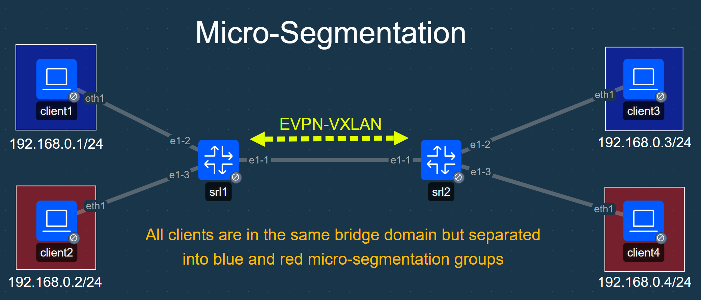

# SR Linux Micro-Segmentation Lab

## Topology


## Lab Description
This lab demonstrates SR Linux microsegmenation capabilities. The lab consists of two SR Linux switches with a single EVPN bridge domain between them. Four clients are created within the bridge domain and are segmented into two segmentation groups:

| Client  | Micro-Segmenation Group | IP Address  |
| ------- | ----------------------- | ----------- |
| client1 | blue                    | 192.168.0.1 |
| client2 | red                     | 192.168.0.2 |
| client3 | blue                    | 192.168.0.3 |
| client4 | red                     | 192.168.0.4 |


The groups are defined through static interface membership and group ID numbers are shared via EVPN using Group Based Policy tags.

## Containerlab Deployment

```
╭─────────┬───────────────────────────────────────────┬─────────┬───────────────────╮
│   Name  │                 Kind/Image                │  State  │   IPv4/6 Address  │
├─────────┼───────────────────────────────────────────┼─────────┼───────────────────┤
│ client1 │ linux                                     │ running │ 172.20.20.7       │
│         │ ghcr.io/srl-labs/network-multitool:latest │         │ 3fff:172:20:20::7 │
├─────────┼───────────────────────────────────────────┼─────────┼───────────────────┤
│ client2 │ linux                                     │ running │ 172.20.20.2       │
│         │ ghcr.io/srl-labs/network-multitool:latest │         │ 3fff:172:20:20::2 │
├─────────┼───────────────────────────────────────────┼─────────┼───────────────────┤
│ client3 │ linux                                     │ running │ 172.20.20.5       │
│         │ ghcr.io/srl-labs/network-multitool:latest │         │ 3fff:172:20:20::5 │
├─────────┼───────────────────────────────────────────┼─────────┼───────────────────┤
│ client4 │ linux                                     │ running │ 172.20.20.4       │
│         │ ghcr.io/srl-labs/network-multitool:latest │         │ 3fff:172:20:20::4 │
├─────────┼───────────────────────────────────────────┼─────────┼───────────────────┤
│ srl1    │ nokia_srlinux                             │ running │ 172.20.20.3       │
│         │ ghcr.io/nokia/srlinux:latest              │         │ 3fff:172:20:20::3 │
├─────────┼───────────────────────────────────────────┼─────────┼───────────────────┤
│ srl2    │ nokia_srlinux                             │ running │ 172.20.20.6       │
│         │ ghcr.io/nokia/srlinux:latest              │         │ 3fff:172:20:20::6 │
╰─────────┴───────────────────────────────────────────┴─────────┴───────────────────╯
```

## Validation
### Client Pings
You should only be able to ping between clients in the same group. You can ping between the following clients:

- client1 <-> client3
- client2 <-> client4

Any attempt to ping across groups will fail.

To ping log into the shell of one of the clients:

``` bash
docker exec -it client1 sh
```

... And attempt to ping another client in the same group:

``` bash
/ # ping -c 5 192.168.0.3
PING 192.168.0.3 (192.168.0.3) 56(84) bytes of data.
64 bytes from 192.168.0.3: icmp_seq=1 ttl=64 time=0.545 ms
64 bytes from 192.168.0.3: icmp_seq=2 ttl=64 time=0.515 ms
64 bytes from 192.168.0.3: icmp_seq=3 ttl=64 time=0.511 ms
64 bytes from 192.168.0.3: icmp_seq=4 ttl=64 time=0.560 ms
64 bytes from 192.168.0.3: icmp_seq=5 ttl=64 time=0.549 ms

--- 192.168.0.3 ping statistics ---
5 packets transmitted, 5 received, 0% packet loss, time 4100ms
rtt min/avg/max/mdev = 0.511/0.536/0.560/0.019 ms
```

You may also ping all clients with the following for loop and validate replies are only received from expected clients:

``` bash
for x in $(seq 1 4); do ping -c 3 -W 1 192.168.0.$x; done
```

### MAC Table
The mac-address table on the SR Linux devices should so the policy tags (you must ping them first before they will show up in the mac-address table).

```
A:admin@srl1# show network-instance bridge-table mac-table all
-------------------------------------------------------------------------------------------------------------------------------------------------------------------------------------
Mac-table of network instance clients
-------------------------------------------------------------------------------------------------------------------------------------------------------------------------------------
+-------------------+-------------------+-------------------+-------------------+-------------------+-------------------+-------------------+-------------------+-------------------+
|      Address      |    Destination    |    Dest Index     |       Type        |      Active       |       Aging       |  Not-Programmed   |     GBP Tags      |    Last Update    |
|                   |                   |                   |                   |                   |                   |      Reason       |                   |                   |
+===================+===================+===================+===================+===================+===================+===================+===================+===================+
| AA:C1:AB:04:13:3E | ethernet-1/3.0    | 5                 | learnt            | true              | 18                | none              | 20 (red)          | 2026-03-          |
|                   |                   |                   |                   |                   |                   |                   |                   | 24T05:52:38.000Z  |
| AA:C1:AB:A8:D5:8A | vxlan-interface:v | 268257571309      | evpn              | true              | N/A               | none              | 10 (blue)         | 2026-03-          |
|                   | xlan0.1           |                   |                   |                   |                   |                   |                   | 24T05:53:17.000Z  |
|                   | vtep:2.2.2.2      |                   |                   |                   |                   |                   |                   |                   |
|                   | vni:1             |                   |                   |                   |                   |                   |                   |                   |
| AA:C1:AB:CF:E1:0C | ethernet-1/2.0    | 4                 | learnt            | true              | 109               | none              | 10 (blue)         | 2026-03-          |
|                   |                   |                   |                   |                   |                   |                   |                   | 24T05:52:43.000Z  |
| AA:C1:AB:EA:D2:03 | vxlan-interface:v | 268257571309      | evpn              | true              | N/A               | none              | 20 (red)          | 2026-03-          |
|                   | xlan0.1           |                   |                   |                   |                   |                   |                   | 24T05:53:17.000Z  |
|                   | vtep:2.2.2.2      |                   |                   |                   |                   |                   |                   |                   |
|                   | vni:1             |                   |                   |                   |                   |                   |                   |                   |
+-------------------+-------------------+-------------------+-------------------+-------------------+-------------------+-------------------+-------------------+-------------------+
Total Irb Macs                 :    0 Total    0 Active
Total Static Macs              :    0 Total    0 Active
Total Duplicate Macs           :    0 Total    0 Active
Total Learnt Macs              :    2 Total    2 Active
Total Evpn Macs                :    2 Total    2 Active
Total Evpn static Macs         :    0 Total    0 Active
Total Irb anycast Macs         :    0 Total    0 Active
Total Proxy Antispoof Macs     :    0 Total    0 Active
Total Reserved Macs            :    0 Total    0 Active
Total Eth-cfm Macs             :    0 Total    0 Active
Total Irb Vrrps                :    0 Total    0 Active
```
### EVPN Routes
The EVPN type-2 routes will also show the GBP tags:

```
A:admin@srl1# show network-instance protocols bgp routes evpn route-type 2 detail
-------------------------------------------------------------------------------------------------------------------------------------------------------------------------------------
Show report for the EVPN routes in network-instance  "*"
-------------------------------------------------------------------------------------------------------------------------------------------------------------------------------------
Route Distinguisher: 2.2.2.2:1
Tag-ID             : 0
MAC address        : AA:C1:AB:A8:D5:8A
IP Address         : 0.0.0.0
neighbor           : 10.1.2.2
path-id            : 0
Received paths     : 1
  Path 1: <Best,Valid,Used,>
    ESI               : 00:00:00:00:00:00:00:00:00:00
    Label             : 1
    Route source      : neighbor 10.1.2.2 (last modified 6m51s ago)
    Route preference  : No MED, No LocalPref
    Atomic Aggr       : false
    BGP next-hop      : 2.2.2.2
    AS Path           :  i [200]
    Domain Path       : None
    Communities       : [target:1:1, gbp-tag:0:10, bgp-tunnel-encap:VXLAN]
    RR Attributes     : No Originator-ID, Cluster-List is []
    Aggregation       : None
    Unknown Attr      : None
    Invalid Reason    : None
    Tie Break Reason  : none
    Route Flap Damping: None
-------------------------------------------------------------------------------------------------------------------------------------------------------------------------------------
Route Distinguisher: 2.2.2.2:1
Tag-ID             : 0
MAC address        : AA:C1:AB:EA:D2:03
IP Address         : 0.0.0.0
neighbor           : 10.1.2.2
path-id            : 0
Received paths     : 1
  Path 1: <Best,Valid,Used,>
    ESI               : 00:00:00:00:00:00:00:00:00:00
    Label             : 1
    Route source      : neighbor 10.1.2.2 (last modified 4m7s ago)
    Route preference  : No MED, No LocalPref
    Atomic Aggr       : false
    BGP next-hop      : 2.2.2.2
    AS Path           :  i [200]
    Domain Path       : None
    Communities       : [target:1:1, gbp-tag:0:20, bgp-tunnel-encap:VXLAN]
    RR Attributes     : No Originator-ID, Cluster-List is []
    Aggregation       : None
    Unknown Attr      : None
    Invalid Reason    : None
    Tie Break Reason  : none
    Route Flap Damping: None
-------------------------------------------------------------------------------------------------------------------------------------------------------------------------------------

```

## Further
This is just a basic example of the feature. Refer to the [micro-segmentation documentation](https://documentation.nokia.com/srlinux/26-3/books/vpn-services/micro-segmentation.html) for more information and features.